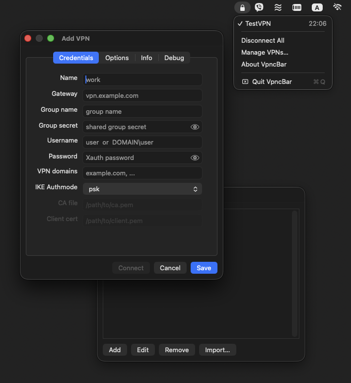

# VpncBar

A native macOS menu-bar front-end for **two** VPN backends:

- **`vpnc`** — Cisco IPSec (IKEv1 + XAUTH). VpncBar ships its own copy, patched to
  use the kernel's native **utun** interface (runs on Apple Silicon / modern macOS
  without the long-dead `tuntaposx` kext) and **statically linked**, so it has no
  MacPorts/Homebrew runtime dependency.
- **`openconnect`** — Cisco **AnyConnect** SSL (and compatible). Uses a system
  `openconnect` and the **same network-config script** as vpnc, with a guided setup
  that fetches the gateway's group list and detects per-group 2FA.

It's a small AppKit app (no Xcode project, no dependencies beyond the system
frameworks) that lives in the status bar and lets you manage profiles, store
secrets in the Keychain, and bring tunnels up and down with a click.

<p align="center">
  
</p>

## Contents

- [Features](#features)
  - [Menu-bar interface](#menu-bar-interface)
  - [Multiple simultaneous connections](#multiple-simultaneous-connections)
  - [Live elapsed timer](#live-elapsed-timer)
  - [Profile editor](#profile-editor)
  - [AnyConnect / OpenConnect profiles](#anyconnect--openconnect-profiles)
  - [Info tab — live tunnel state](#info-tab--live-tunnel-state)
  - [Debug tab — vpnc logs](#debug-tab--vpnc-logs)
  - [Keychain-backed secrets](#keychain-backed-secrets)
  - [Config import](#config-import)
  - [Split DNS](#split-dns)
  - [Native utun, statically linked](#native-utun-statically-linked)
  - [Notifications](#notifications)
  - [Graceful teardown](#graceful-teardown)
- [Requirements](#requirements)
- [Build](#build)
- [Install](#install)
- [Uninstall](#uninstall)
- [Certificate support](#certificate-support)
- [Usage](#usage)
- [Where things are stored](#where-things-are-stored)
- [Cleaning up](#cleaning-up)
- [How it's put together](#how-its-put-together)
- [Licensing](#licensing)

---

## Features

### Menu-bar interface

- Runs as a status-bar item (no Dock icon); the whole UI is its menu.
- Each VPN profile is one row showing a **✓ when connected** and the profile name.
- **Left-click a row** to connect or disconnect it.
- **Right-click (or Control-click) a row** to open its editor.
- A **Disconnect All** item appears whenever one or more tunnels are up.
- **Manage VPNs…** and **About VpncBar** round out the menu.
- Connect/disconnect/edit actions are non-blocking; the menu stays responsive.

### Multiple simultaneous connections

- You can connect to **several VPNs at once** — each profile runs its own `vpnc`
  process with its own PID file, so tunnels are independent.
- Split-include routes from every gateway are installed side by side; the system
  **default route is never touched**, so full-tunnel profiles coexist instead of
  fighting over the default gateway.
- A safeguard prevents launching the **same profile twice**.

### Live elapsed timer

- Each connected row shows how long the tunnel has been up, right-aligned in
  **monospaced digits** so it doesn't jitter.
- The timer ticks every second while the menu is open and refreshes on a short
  background interval otherwise.

### Profile editor

One editor window per profile (opening it again just brings it forward). A
**Type** selector (vpnc | openconnect — locked once the profile is saved) switches
the fields and tabs to match the backend; below covers a **vpnc** profile (for
openconnect see [AnyConnect / OpenConnect profiles](#anyconnect--openconnect-profiles)).
Up to four tabs, plus a **Connect/Disconnect** button whose label tracks the live state:

**Credentials**
- Name, Gateway, Group name, Group secret, Username, Password.
- **VPN domains** — comma-separated match domains for scoped DNS (e.g.
  `example.com, corp.local`).
- **IKE Authmode** — `psk`, `hybrid`, or `cert`.
- **CA file** and **Client cert** paths for certificate-based auth.
- Password fields show **dots when a secret is stored** and have an **eye button**
  to reveal the value.

**Options**
- DH Group, PFS, NAT-T Mode, Vendor, Interface MTU, DPD timeout (default 30s),
  Debug level, and the Encryption toggles (weak/3DES, single-DES, no-encryption,
  weak auth). Dropdowns are pre-filled with their real defaults.

**Info** and **Debug** — see below.

The Credentials tab grays out (~20% opacity) fields that don't apply to the
selected IKE Authmode, so only the relevant credentials are editable:

| Field          | psk | hybrid | cert |
|----------------|:---:|:------:|:----:|
| Group name     |  ✓  |   ✓    |  ✓   |
| Group secret   |  ✓  |   ·    |  ·   |
| Username / Password (XAUTH) | ✓ | ✓ | ✓ |
| CA file        |  ·  |   ✓    |  ✓   |
| Client cert    |  ·  |   ·    |  ✓   |

If your `vpnc` binary was built **without** TLS/SSL, choosing `hybrid`/`cert`
shows a note explaining the cert fields won't take effect (see
[Certificate support](#certificate-support)).

### AnyConnect / OpenConnect profiles

Set a profile's **Type** to **openconnect** to connect to a Cisco **AnyConnect**
SSL gateway via a system `openconnect` (Homebrew/MacPorts). The editor swaps to the
relevant fields — **Gateway** (server), **Auth group**, **Server cert** (pin),
**Username**, **Password**, **VPN domains**, **Client cert** — and hides the
IPSec-only Options tab.

**Guided setup (one-time):**
- **Fetch groups** contacts the gateway and fills the **Auth group** dropdown with
  the groups it offers (you can also just type one). It's a single credential-less
  probe — no tunnel, no root.
- Picking a group **auto-detects 2FA**: if the gateway marks that group as needing a
  second factor (`second-auth="1"`), VpncBar ticks **"Ask for one-time code"**.
- **Save** → a normal static profile. Every connect after is direct (no re-probing).

**Connecting** runs `openconnect --protocol=anyconnect --authgroup=… --script
<vpnc-script> …` with the password piped on stdin (and, for 2FA groups, a prompt for
the current one-time code — e.g. Google Authenticator). It reuses the **same
`vpnc-script`** as vpnc, so routes and scoped DNS behave identically, and Info/Debug
work the same way.

> SAML/SSO sign-in isn't supported yet. Profiles authenticate with
> username/password (+ optional client cert) and an optional one-time code.

### Info tab — live tunnel state

While connected (and only while the tab is visible), the Info tab shows, refreshed
every second: **Status**, **Uptime**, **Interface** (`utunN`), **Traffic in/out**
(bytes + packets, via `netstat`), **Internal IP**, **Gateway**, **DNS**, **Match
domains**, **Routes**, and the exact **vpnc command** line. During teardown it
shows `Disconnecting…` while keeping the last-known details until the tunnel is
fully down.

### Debug tab — vpnc logs

vpnc writes its whole session (handshake, debug output, start/stop) to a
per-profile log via its `--log-file` option, **truncated per connect** so you only
see the current session. The Debug tab **tails that file live** (~4×/sec) while
visible, with **Clear log** and **Reveal log** buttons. Raise the **Debug level**
(Options tab) for verbose, packet-level detail.

### Keychain-backed secrets

- Group secrets and XAUTH passwords are stored as macOS Keychain generic
  passwords — **never in the profile JSON**.
- Keychain items are keyed by a **stable per-profile UUID**, so renaming a
  profile is purely cosmetic and never loses or duplicates its secrets.

### Config import

- From the **Manage VPNs** window, **Import…** a Cisco **`.pcf`** or a `vpnc`
  **`.conf`** file.
- Obfuscated secrets in `.pcf` files (`enc_GroupPwd`, `enc_UserPassword`) are
  decoded with **`cisco-decrypt`** and stored straight into the Keychain.
- After import you're told which fields, if any, still need to be filled in.

### Split DNS

- DNS is configured **per tunnel and scoped to the VPN's domains** — your normal
  DNS keeps working for everything else.
- A scoped resolver is registered at `State:/Network/Service/<utunN>/DNS` with
  `SupplementalMatchDomains` from the gateway (`CISCO_DEF_DOMAIN`,
  `CISCO_SPLIT_DNS`) plus the **VPN domains** you set on the profile.
- The upstream global-DNS takeover is removed, so a connecting VPN can't hijack
  your primary resolver. If no match domain is known, that VPN's DNS is skipped
  rather than applied globally.
- The gateway hostname is resolved to an IP **before** connecting, so a gateway
  living under its own scoped domain doesn't become unreachable once the tunnel's
  DNS takes effect.

### Native utun, statically linked

The bundled `vpnc` opens a `PF_SYSTEM` / `SYSPROTO_CONTROL` socket against the
`com.apple.net.utun_control` kernel control to get a `utunN` interface — the same
mechanism the OS uses for its own VPNs, no third-party kext. Its crypto
(`libgcrypt` + `libgpg-error`) is **compiled from source and linked statically**,
so the only dynamic dependency is `/usr/lib/libSystem` — it runs on any Mac with
**no MacPorts/Homebrew** required.

### Notifications

- A macOS notification fires when a tunnel **connects** and when it
  **disconnects** (state changes are detected by diffing the live tunnel set).
- If notifications are disabled in System Settings, VpncBar tells you how to
  enable them instead of failing silently.

### Graceful teardown

- Disconnecting a profile signals its specific `vpnc` (by PID or PID file) via the
  patched **`vpnc-disconnect`**, which verifies the target really is `vpnc` before
  killing it — running the script's teardown to restore routes + scoped DNS.
- The app **disconnects every tunnel when it's terminated** — on ⌘Q, and via a
  **SIGTERM/SIGINT handler** so a `kill`/`pkill VpncBar`, logout, or shutdown also
  tears tunnels down (only an uncatchable `kill -9` is exempt).

---

## Requirements

- **macOS 13+** (Apple Silicon; the app and `vpnc` are built for `arm64`).
- **Xcode Command Line Tools** — provides `swiftc`, `cc`/`make`, and `pkgbuild`
  (`xcode-select --install`).
- **An internet connection for the first build** — `build.sh` downloads the
  `libgpg-error` + `libgcrypt` source from gnupg.org to build them statically.
  After that it's cached in `vendor/deps/`.
- **No MacPorts or Homebrew** is needed for **vpnc** profiles, at build or run time.
- **`openconnect`** is required **only for AnyConnect profiles** — install it
  separately (`brew install openconnect`, or MacPorts). VpncBar finds it at
  `/opt/homebrew/bin`, `/opt/local/bin`, or `/usr/local/bin`.

## Build

Everything builds through one script — `./build.sh [all|deps|vpnc|app|pkg]`
(default `all`, run in that order):

```sh
./build.sh          # deps → vpnc → app → pkg  (the whole thing)
./build.sh deps     # static libgcrypt + libgpg-error from source → vendor/deps
./build.sh vpnc     # the static, utun-capable vpnc → vendor/vpnc/bin
./build.sh app      # VpncBar.app (swiftc, ad-hoc signed) → bin/
./build.sh pkg      # a distributable installer → dist/VpncBar-<version>.pkg
```

The `vpnc` and `pkg` targets build their prerequisites automatically if missing.

## Install

Two ways — both put the app in `/Applications`, the `vpnc` package in
`/opt/vpncbar`, and a passwordless-sudo rule in `/etc/sudoers.d/vpncbar`:

**A. Installer package** (self-contained; good for distribution)

```sh
./build.sh pkg
sudo installer -pkg dist/VpncBar-1.2.pkg -target /   # or just double-click the .pkg
```

> The `.pkg` is **unsigned** by default. A *downloaded* unsigned pkg trips
> Gatekeeper (right-click → Open, or allow in System Settings). To sign for real
> distribution, set a Developer ID and notarize:
> `PKG_SIGN_ID="Developer ID Installer: …" ./build.sh pkg`, then
> `xcrun notarytool submit … && xcrun stapler staple dist/VpncBar-1.2.pkg`.

**B. From source** (`install.sh` builds anything missing, then installs)

```sh
./install.sh        # run as your normal user; it sudo's only the privileged steps
open /Applications/VpncBar.app
```

The first run sets up notification permission and the sudoers rule so VpncBar can
run `vpnc`/`vpnc-disconnect` as root without prompting each time. The sudoers rule
also covers `openconnect` at the standard Homebrew/MacPorts/local paths.

### For AnyConnect (openconnect) profiles

`openconnect` is **not bundled** — it must be installed via **Homebrew or MacPorts**:

```sh
brew install openconnect      # Homebrew  → /opt/homebrew/bin/openconnect
# or
sudo port install openconnect # MacPorts  → /opt/local/bin/openconnect
```

VpncBar auto-detects it (Homebrew → MacPorts → `/usr/local`). Without it, vpnc
profiles work fine; AnyConnect profiles will tell you to install it.

## Uninstall

Any of these — all remove `VpncBar.app`, `/opt/vpncbar`, and the sudoers rule,
disconnect all tunnels first, and **keep** your profiles + Keychain secrets:

- **In the app:** menu → **About VpncBar** → **Uninstall VpncBar…** (asks for
  admin auth; quits the app and removes everything).
- **From a terminal:** `./uninstall.sh` (from the source tree) or
  `/opt/vpncbar/uninstall.sh` (installed). The script self-elevates with `sudo`.

For a full wipe, also delete `~/.config/vpncbar` and the `vpnc-<uuid>-…` items in
your login Keychain.

## Certificate support

The default build uses `CRYPTO_NONE=yes` — **PSK + XAUTH only, no X.509** — which
is what keeps `vpnc` free of a TLS dependency. The `cert`/`hybrid` authmodes are
therefore present in the UI but inert in the default build; VpncBar detects this
(via `otool -L`) and shows a note. Building `vpnc` with a TLS backend (GnuTLS or
OpenSSL) to enable them is documented in [`vendor/NOTICE`](vendor/NOTICE),
including the OpenSSL licensing caveat.

## Usage

1. Menu-bar icon → **Manage VPNs…** → **Add** a profile (or **Import…** a
   `.pcf`/`.conf`).
2. Pick the **Type** — **vpnc** (Cisco IPSec) or **openconnect** (AnyConnect SSL,
   needs `brew install openconnect`); for openconnect use **Fetch groups** to fill
   the group dropdown and auto-detect 2FA.
3. **Left-click** a profile row to connect; click again to disconnect.
4. **Right-click** a row to edit it (Credentials / Options / Info / Debug + a
   Connect/Disconnect button).
5. **About VpncBar** shows version info and the **Uninstall** button.

## Where things are stored

| What | Where |
|------|-------|
| Profiles (no secrets) | `~/.config/vpncbar/profiles.json` |
| PID files + per-session logs | `~/.config/vpncbar/run/` |
| Live tunnel info (Info tab) | `/var/run/vpncbar/<uuid>.info` (written by `vpnc-script`) |
| Secrets | macOS **login Keychain**, items `vpnc-<uuid>-secret` / `…-password` |
| Installed binaries + script | `/opt/vpncbar/` |
| sudoers rule | `/etc/sudoers.d/vpncbar` |

## Cleaning up

```sh
./clean.sh         # remove all build artifacts (sources kept)
./clean.sh app     # just the VpncBar.app build (bin/)
./clean.sh vpnc    # just the vendored vpnc objects/binaries
./clean.sh deps    # just the static crypto libs (vendor/deps)
./clean.sh pkg     # just the installer artifacts (build/ + dist/)
```

## How it's put together

| Component | What it is |
|-----------|------------|
| `src/` | The Swift/AppKit app (`main.swift`), `Info.plist`, app icon + generator. |
| `vendor/vpnc/` | A vendored, utun-patched `vpnc` (fork of `vpnc` 0.5.3 + breiter's xnu utun port), with a `--log-file` option added. GPLv2. |
| `vendor/vpnc-script` | The network-config script (from OpenConnect), patched for scoped DNS and a hands-off default route — used by **both** vpnc and openconnect. |
| `vendor/deps/` | Statically-built `libgcrypt` + `libgpg-error` (gitignored; produced by `build.sh deps`). |
| `openconnect` | **Not** vendored — a system install (Homebrew/MacPorts), used only for AnyConnect profiles. |
| `vendor/NOTICE` | Provenance, licensing, and a full list of local modifications. |

Installed runtime layout — everything in **one folder**, referenced by absolute
path (no symlinks):

```
/opt/vpncbar/
    vpnc            vpnc-disconnect
    vpnc-script     cisco-decrypt
    uninstall.sh
```

## Licensing

The app is in this repository's [`LICENSE`](LICENSE). The vendored components
(`vendor/vpnc`, `vendor/vpnc-script`) and the statically-linked
`libgcrypt`/`libgpg-error` are **GPLv2 / GPLv2-or-later / LGPL**; full source and a
detailed list of local modifications are in [`vendor/NOTICE`](vendor/NOTICE).
